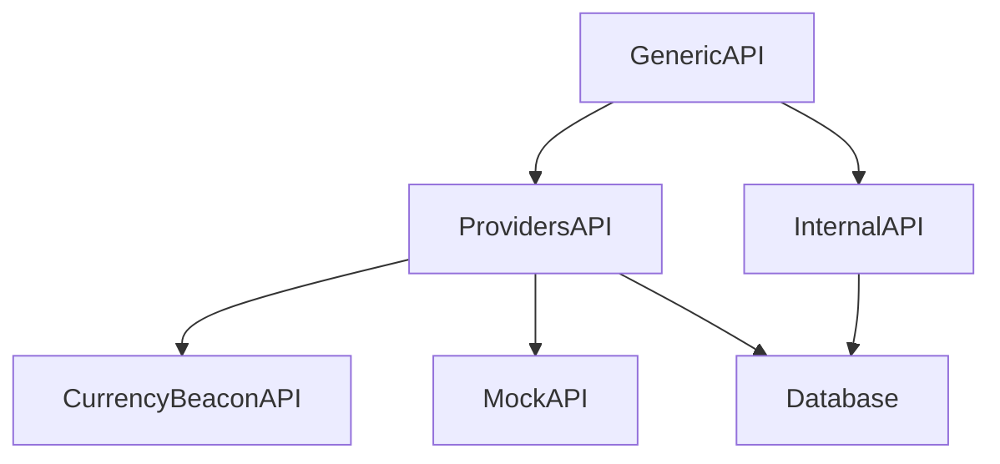

# MyCurrency - Currency Exchange Rate Platform

MyCurrency is a robust platform designed to fetch, store, and provide currency exchange rates from multiple providers. It offers a unified API interface to access exchange rates, historical data, and currency conversion functionality.

## Features

- Multiple currency exchange rate providers support
- Real-time exchange rates
- Historical exchange rate data
- Currency conversion functionality
- Time series data for trend analysis
- Provider priority management
- Automatic data updates via cron jobs

## Technical Stack

- Python 3.11+
- Django 5.1+
- Django REST Framework
- SQLite3
- AsyncIO for asynchronous operations
- Pytest for testing

## Installation

1. Install `docker-compose`:
```
https://docs.docker.com/compose/install/
```

2. Create Docker containers with `docker-compose`:
```bash
docker-compose up --build
```

## Project Structure

```
MyCurrency/
├── backbase_app/
│   ├── api/
│   │   ├── generic_api.py          # Main API interface
│   │   └── providers_api.py        # Provider-specific implementations
│   │   └── internal_api.py         # Internal API
│   ├── external_services/
│   │   ├── api_mock.py             # Mock API implementation
│   │   └── api_currencybeacon.py   # CurrencyBeacon API implementation
│   ├── models.py                   # Database models
│   └── tests/                      # Test suite
        ├── test_api/
        │   ├── test_generic_api.py
        │   ├── test_internal_api.py
        │   └── test_providers_api.py
        └── test_external_services/
            ├── test_currencybeacon.py
            └── test_mock.py
├── backbase_project/               # Django project settings
└── manage.py
```

## Background Tasks with Celery

The project uses Celery for handling background tasks and Celery Beat for scheduled tasks. This setup allows for asynchronous processing of exchange rate updates and other time-consuming operations.

### Celery Configuration

The Celery configuration is set up in `backbase_project/settings.py`:

```python
# Celery Configuration
CELERY_BROKER_URL = 'redis://redis:6379/0'
CELERY_RESULT_BACKEND = 'redis://redis:6379/0'
CELERY_ACCEPT_CONTENT = ['json']
CELERY_TASK_SERIALIZER = 'json'
CELERY_RESULT_SERIALIZER = 'json'
CELERY_TIMEZONE = 'UTC'

# Celery Beat Configuration
CELERY_BEAT_SCHEDULE = {
    'update-exchange-rates': {
        'task': 'backbase_app.tasks.update_exchange_rates',
        'schedule': crontab(hour=0, minute=0),  # Run daily at midnight
    },
}
```

### Docker Setup

When using Docker, Celery services are automatically configured in `docker-compose.yml`:

### Monitoring

Celery tasks can be monitored using Flower:

Access the Flower dashboard at `http://localhost:5555`

## API Usage Examples

### 1. Get Latest Exchange Rates

```python
from backbase_app.api.generic_api import GenericAPI

async def get_latest_rates():
    api = GenericAPI()
    rates = await api.get_latest_rates("USD", ["EUR", "GBP"])
    return rates
```

### 2. Convert Currency

```python
async def convert_currency():
    api = GenericAPI()
    result = await api.get_convert_amount("USD", "EUR", 100)
    return result
```

### 3. Get Historical Rates

```python
async def get_historical_data():
    api = GenericAPI()
    data = await api.get_currency_rates_list(
        start_date="2025-01-01",
        end_date="2025-01-31",
        base="USD",
        symbols="EUR, GBP"
    )
    return data
```

## Functional Examples

### 1. Real-time Currency Conversion

```python
# Convert 100 USD to EUR
result = await api.get_convert_amount("USD", "EUR", 100)
print(f"100 USD = {result['value']} EUR")
```

### 2. Historical Rate Analysis

```python
# Get exchange rates for the last month
rates = await api.get_currency_rates_list(
    start_date="2025-02-01",
    end_date="2025-02-29",
    base="USD",
    symbols="EUR, GBP"
)

# Analyze the trend
for date, rate_data in rates.items():
    print(f"Date: {date}")
    print(f"EUR: {rate_data['EUR']}")
    print(f"GBP: {rate_data['GBP']}")
```


## Error Handling

The API includes comprehensive error handling:

```python
try:
    result = await api.get_convert_amount("USD", "EUR", 100)
except ValueError as e:
    print(f"Invalid input: {e}")
except Exception as e:
    print(f"An error occurred: {e}")
```

## Testing

The project includes a comprehensive test suite:

```bash
# Run all tests
pytest

# Run specific test file
pytest backbase_app/tests/test_api/test_api_generic.py
```

## API Endpoints

### REST API

#### 1. Get Exchange Rate Data
```http
GET /api/v1/exchange_rate_data/
```

**Parameters:**
| Parameter | Type | Description | Example |
|-----------|------|-------------|---------|
| source_currency | string | Base currency code | USD |
| exchanged_currency | string | Target currency code | EUR |
| valuation_date | date | Date for the exchange rate (YYYY-MM-DD) | 2025-01-21 |

### Example API Response

```json
{
    "rate_value": 0.561955
}
```

#### 2. Get Currency Rates List
```http
GET /api/v1/currency_rates_list/
```

**Parameters:**
| Parameter | Type | Description | Example |
|-----------|------|-------------|---------|
| start_date | date | Start date for historical rates (YYYY-MM-DD) | 2025-03-20 |
| end_date | date | End date for historical rates (YYYY-MM-DD) | 2025-03-23 |
| base | string | Base currency code | USD |
| symbols | string | Comma-separated list of currency codes | GBP, EUR, CHF |

### Example API Response

```json
{
    "2025-03-20": {
        "GBP": 0.209854,
        "CHF": 0.261696,
        "EUR": 0.901946
    },
    "2025-03-21": {
        "GBP": 0.931227,
        "CHF": 0.624838,
        "EUR": 0.116947
    },
    "2025-03-22": {
        "GBP": 0.98858,
        "CHF": 0.545573,
        "EUR": 0.760298
    },
    "2025-03-23": {
        "GBP": 0.676678,
        "CHF": 0.537344,
        "EUR": 0.245048
    }
}
```

#### 3. Convert Amount
```http
GET /api/v1/convert_amount/
```

**Parameters:**
| Parameter | Type | Description | Example |
|-----------|------|-------------|---------|
| currency_base | string | Source currency code | USD |
| currency_to_convert | string | Target currency code | EUR |
| amount | number | Amount to convert | 100 |

### Example API Response

```json
{
    "timestamp": 1743465600,
    "date": "2025-04-01",
    "from": "USD",
    "to": "EUR",
    "amount": "100",
    "value": 92.7146
}
```

### API Relationships



1. **GenericAPI → ProvidersAPI**
   - Routes external requests to appropriate provider
   - Manages provider selection
   - Handles provider fallback

2. **GenericAPI → InternalAPI**
   - Routes internal requests to database
   - Manages data persistence
   - Handles historical data

3. **ProvidersAPI → External APIs**
   - Manages CurrencyBeaconAPI and MockAPI
   - Coordinates data fetching
   - Handles provider-specific logic

4. **ProvidersAPI → Database**
   - Persists exchange rates
   - Manages data updates
   - Handles data consistency

5. **InternalAPI → Database**
   - Retrieves historical data
   - Manages data queries
   - Handles data formatting

## Postman

```
Backbase.postman_collection.json
```

## License

This project is licensed under the MIT License - see the LICENSE file for details.

## Support

For support, please open an issue in the GitHub repository or contact the maintainers.